# Борисенко Дарья IA2403 ( informatica aplicata )
## Продвинутый уровень  собственное приложение , вариант деплоя : А, 
https://github.com/rityu-cloud/timecapsule.git

### Базовый уровень 

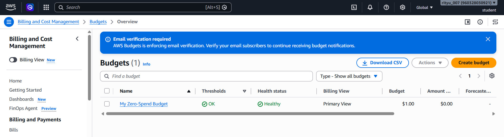
Нулевой бюджет (ZeroSpend ) установлен

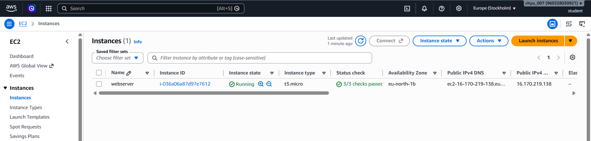
Экземпляр webserver в состоянии Running с пройденными 3/3 проверками 

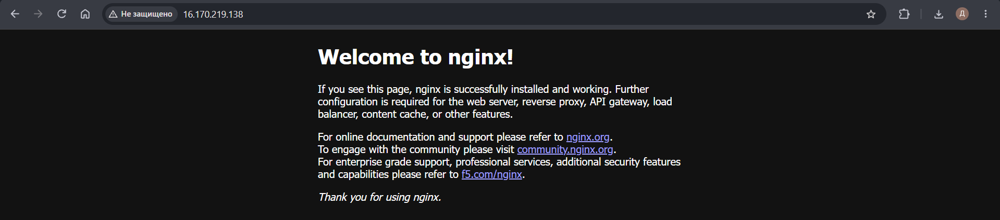
Проверка успешной установки и запуска nginx на виртуальной машине AWS EC2 с доступом по публичному IP-адресу

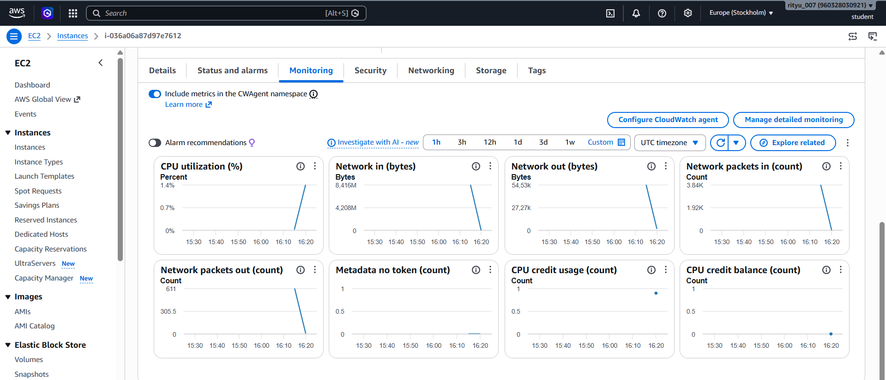
Мониторинг работы виртуальной машины AWS EC2

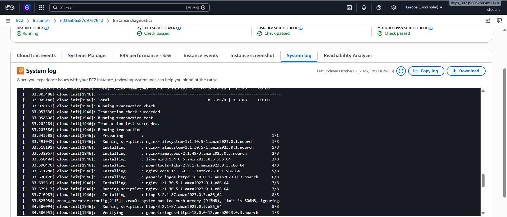
Фрагмент System log с установкой nginx

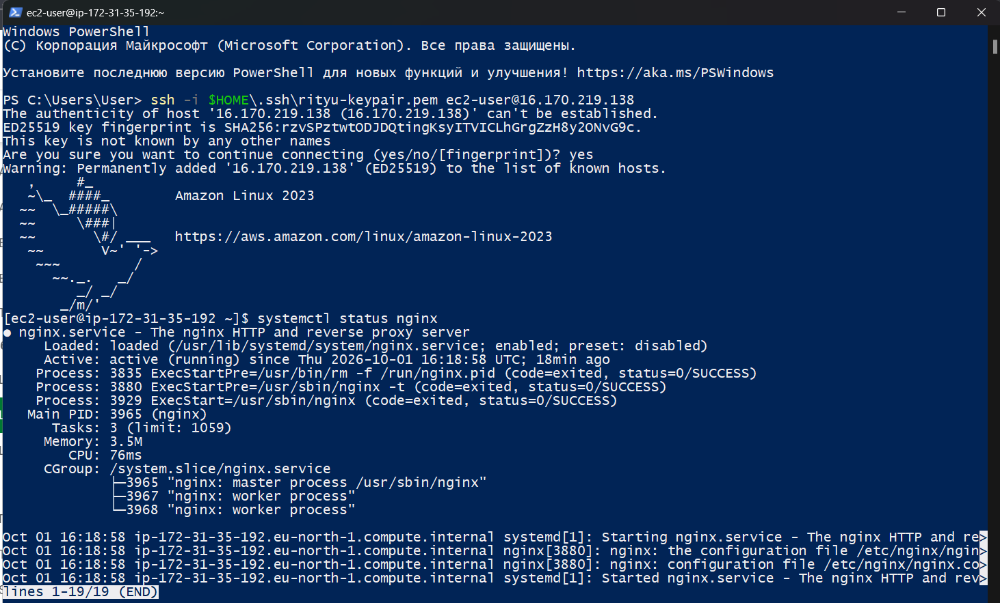
Успешное подключение к ВМ по SSH и вывод systemctl status nginx

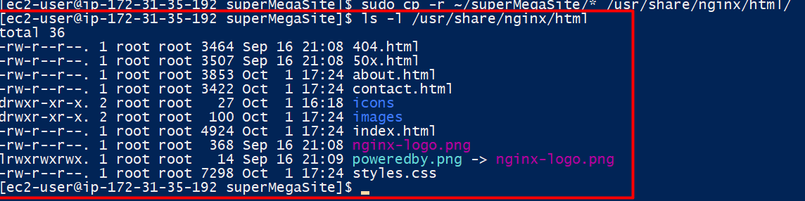
Копирование файлов веб-приложения в директорию /usr/share/nginx/html на сервере

Сайт в браузере 

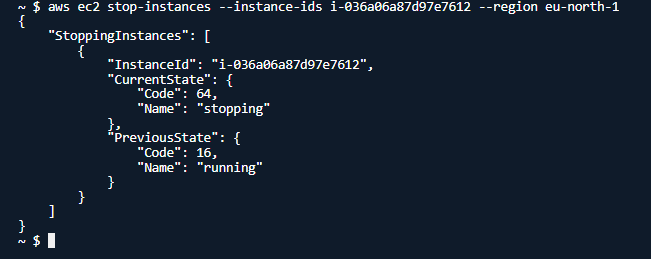
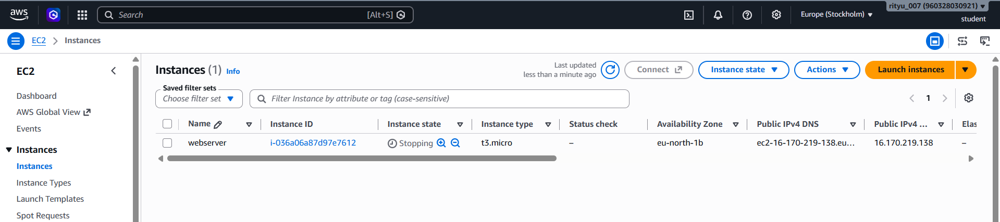
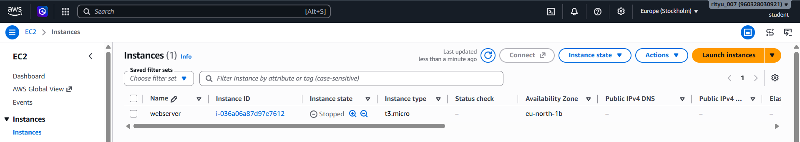
Команда aws ec2 stop-instances и её вывод

### Продвинутый уровень 

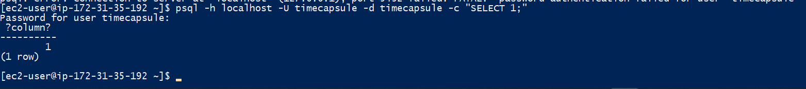
Проверка подключения к базе данных  на виртуальной машине 

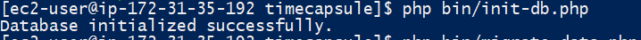
Успешная инициализация базы данных 

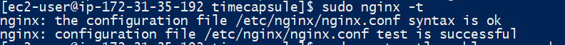
Проверка корректности конфигурации nginx

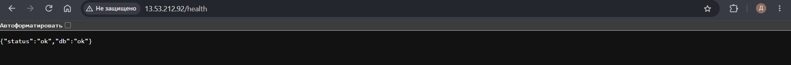
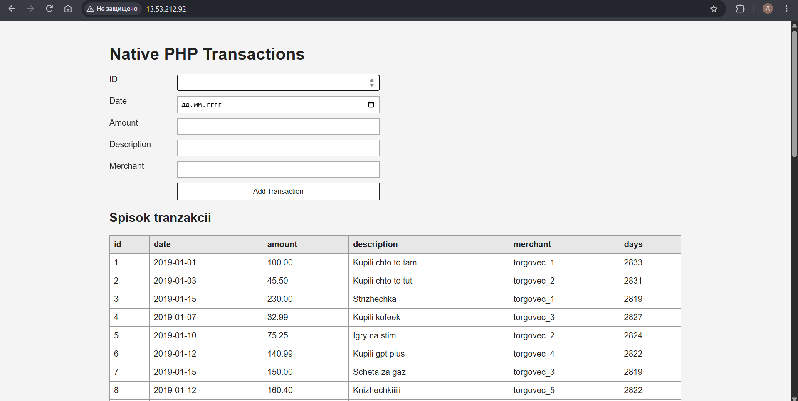
Приложение в браузере и ответ /health

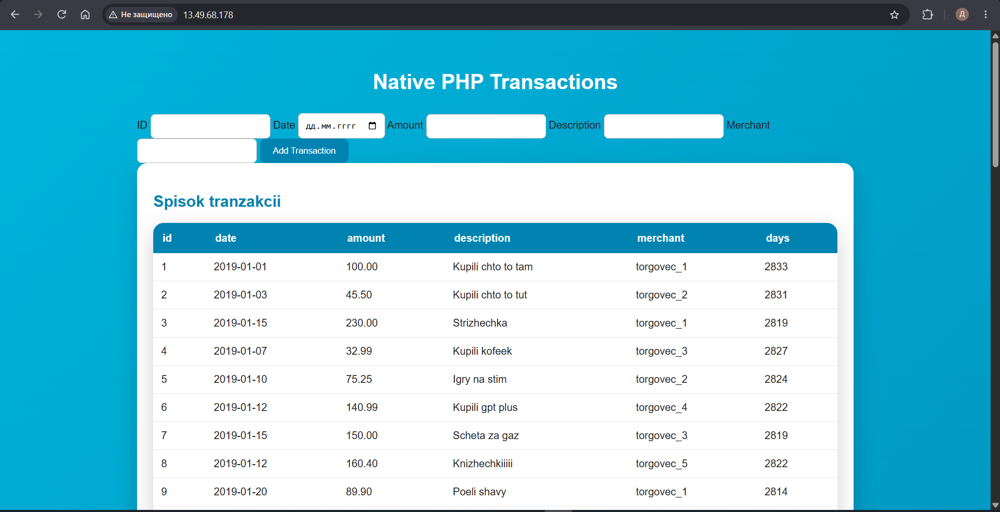
Новая версия страницы с изменениями 

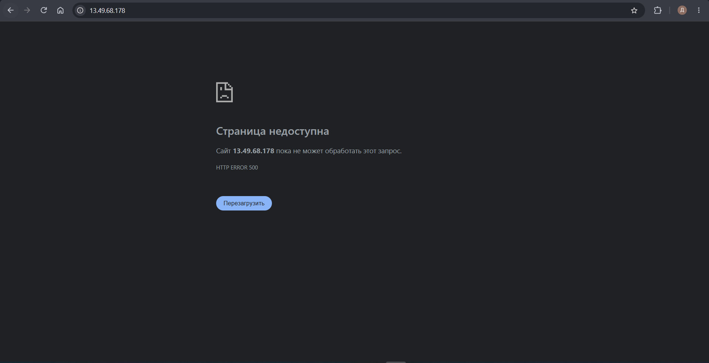
Поломали страницу 

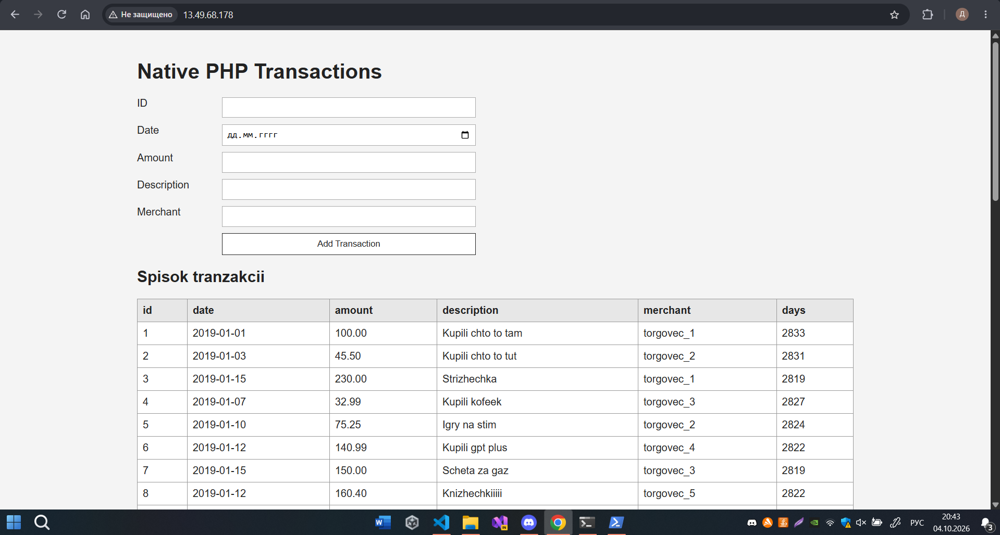
Откат с помощью git revert 

### Архитектура 

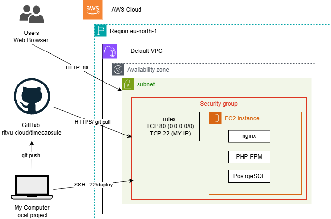

### Ответы на вопросы : 

***Что такое User data и когда выполняется этот скрипт? Выполнится ли он повторно после перезагрузки экземпляра?***

User data  это скрипт, который EC2 автоматически выполняет при первом запуске нового экземпляра.После обычной перезагрузки экземпляра скрипт User data повторно не выполняется.

***Какая из проверок укажет на проблему, которую можете исправить вы, а какая на проблему на стороне AWS?***

System status check — проблема на стороне AWS
Instance status check — проблема на стороне самого экземпляра
Attached EBS status check — проблема с подключённым хранилищем EBS

***В каких случаях стоит включать детальный мониторинг?***

Детальный мониторинг стоит включать, когда нужно глубже отслеживать состояние EC2 и искать причины проблем

***Почему для входа на экземпляр EC2 используется ключ, а не пароль?***

Потому что ssh ключ безопаснее обычного пароля.

***Что делает команда scp и чем она похожа на ssh?***

scp используется для копирования файлов между компьютерами по ssh. scp и ssh оба используют ssh соединение но делают разное

***Чем Stop отличается от Terminate? За что вы продолжаете платить, пока экземпляр остановлен?***

При Stop экземпляр выключается, но его EBS-диск сохраняется, и его можно снова запустить. При Terminate экземпляр удаляется , а вместе с ним  удаляется и корневой EBS-том.

***Почему папка vendor/ и файл .env не попали в репозиторий? Найдите ответ в файле .gitignore.***

Папки vendor/ и файла .env нет в репозитории, потому что они указаны в .gitignore, поэтому Git игнорирует их при добавлении файлов.

***Почему пароль к базе данных хранится в файле .env на сервере, а не в коде в репозитории? Почему публичный репозиторий безопасен для этого приложения?***

Пароль хранится в .env на сервере, а не в коде, потому что .env содержит конфиденциальные данные. Файл добавлен в .gitignore, поэтому он не попадает в публичный GitHub-репозиторий.

***git pull заменяет файлы по одному, и это занимает несколько секунд. Что может увидеть посетитель, который откроет сайт в этот момент? Что случится с сайтом, если после git pull не выполнится composer install?***

При обычном git pull файлы могут обновляться постепенно, поэтому посетитель в этот момент может увидеть смешанное состояние приложения. Это может привести к ошибкам или некорректной работе сайта.Если после git pull не выполнить composer install, то зависимости из composer.json могут не соответствовать коду. В результате приложение может завершиться ошибкой

***Почему /health отвечает ok, хотя главная страница не работает? Что на самом деле проверяет этот адрес? Чего не хватает такой проверке?***

/health отвечает ok, потому что этот адрес выполняет отдельную простую проверку доступности приложения и базы данных. Он проверяет, что PHP может подключиться к PostgreSQL и выполнить запрос SELECT 1.

***Сколько времени сайт был сломан? Из каких шагов сложилось это время? Как можно было бы сократить его?***

Время простоя складывается из всех действий от момента внесения ошибки до успешного отката:
- Добавление синтаксической ошибки и git push.
- Подключение к серверу по SSH.
- Выполнение git pull и остальных команд деплоя.
- Обнаружение ошибки 500.
- Выполнение git revert, git push и повторного деплоя.

